# 00 — Consultant Process-Capture Flow

This is the mental-model companion for the Consultant Process-Capture Lane.

Diagram legend: blue = preparation step, teal = elicitation/drafting step,
purple = packaging/handoff concept, amber diamond = gate, green stadium =
verified outcome, cylinder = durable artifact. Dashed arrows are loop-backs
or conditional paths. See [visuals/README.md](README.md#reading-these-diagrams)
for the shape vocabulary.

```mermaid
flowchart TB
    classDef primary fill:#eff6ff,stroke:#2563eb,color:#111827,stroke-width:1.5px
    classDef delivery fill:#ecfeff,stroke:#0f766e,color:#111827,stroke-width:1.5px
    classDef model fill:#f5f3ff,stroke:#7c3aed,color:#111827,stroke-width:1.5px
    classDef gate fill:#fffbeb,stroke:#b45309,color:#111827,stroke-width:1.5px
    classDef outcome fill:#f0fdf4,stroke:#15803d,color:#111827,stroke-width:1.5px
    classDef artifact fill:#f8fafc,stroke:#475569,color:#111827,stroke-width:1.5px

    subgraph prep["1. Prepare"]
        direction TB
        p1["Name one process in operator language"] --> p2["Set start and end boundary"]
        p2 --> p3["Identify owner and SME"]
        p3 --> p4["Agree capture success definition"]
        p4 --> g1{"Scope agreed?"}
    end
    class p1,p2,p3,p4 primary
    class g1 gate
    style prep fill:#ffffff,stroke:#cbd5e1

    g1 -.->|"no"| p2
    g1 -->|"yes"| e0

    subgraph elicit["2. Gather and normalize evidence"]
        direction TB
        e0{"Entry path?"}
        e1["Guided elicitation<br/>observe, walk through, or interview SME"]
        e2["Existing evidence dump<br/>transcript, notes, SOP, or sanitized excerpt"]
        e3["Retain source separately<br/>record lightweight provenance"]
        e4["Normalize candidates<br/>classify claims and preserve SME terms"]
        e5["List contradictions, time dependencies,<br/>targeted questions, and open gaps"]
        e0 -->|"guided"| e1
        e0 -->|"existing evidence"| e2
        e1 --> e3
        e2 --> e3
        e3 --> e4 --> e5 --> g2{"Evidence sufficient for draft?"}
    end
    class e1,e2,e3,e4,e5 delivery
    class e0,g2 gate
    style elicit fill:#ffffff,stroke:#cbd5e1

    g2 -.->|"no — more gaps"| e0
    g2 -->|"yes"| d1

    subgraph draft["3. Draft"]
        direction TB
        d1["Structure notes into PROCESS_CAPTURE.md"] --> d2["Preserve SME terms"]
        d2 --> d3["Move inferences to open questions"]
        d3 --> art[("PROCESS_CAPTURE.md draft")]
        art --> g3{"Draft honest — gaps visible?"}
    end
    class d1,d2,d3 delivery
    class art artifact
    class g3 gate
    style draft fill:#ffffff,stroke:#cbd5e1

    g3 -.->|"no — invented or missing tags"| d1
    g3 -->|"yes"| v1

    subgraph validate["4. Validate and hand off"]
        direction TB
        v1["Walk draft with SME"] --> v2["Disposition every open question"]
        v2 --> g4{"SME sign-off?"}
        g4 -.->|"no — corrections"| d1
        g4 -->|"yes"| v3[("Signed PROCESS_CAPTURE.md")]
        v3 --> v4["Version and store canonically"]
        v4 --> v5["Attach complete approved<br/>procedure context to LLM"]
        v5 --> v6(["New hire follows process<br/>without invented steps"])
    end
    class v1,v2,v4,v5 model
    class g4 gate
    class v3 artifact
    class v6 outcome
    style validate fill:#ffffff,stroke:#cbd5e1
```

The procedural guides remain the step-by-step operating layer.

[Back to the lane index](../README.md)
