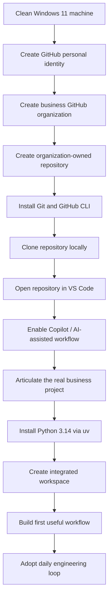
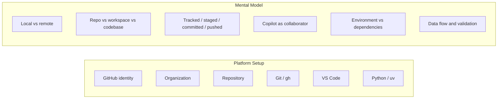
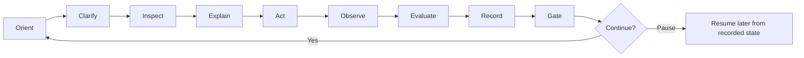
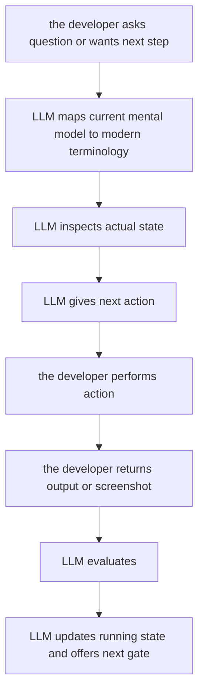
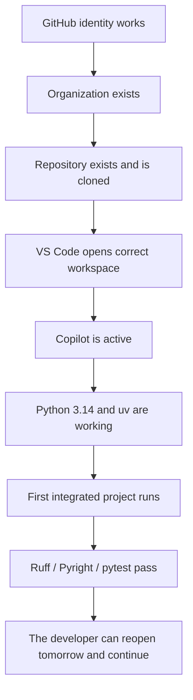

# 00 — Visual Meta Flow

This file shows the overall journey.

## The big picture

```mermaid
flowchart TD
    A[Clean Windows 11 machine] --> B[Create GitHub personal identity]
    B --> C[Create business GitHub organization]
    C --> D[Create organization-owned repository]
    D --> E[Install Git and GitHub CLI]
    E --> F[Clone repository locally]
    F --> G[Open repository in VS Code]
    G --> H[Enable Copilot / AI-assisted workflow]
    H --> I[Articulate the real business project]
    I --> J[Install Python 3.14 via uv]
    J --> K[Create integrated workspace]
    K --> L[Build first useful workflow]
    L --> M[Adopt daily engineering loop]
```

## Two tracks are running at once

```mermaid
flowchart LR
    subgraph Platform Setup
        A1[GitHub identity]
        A2[Organization]
        A3[Repository]
        A4[Git / gh]
        A5[VS Code]
        A6[Python / uv]
    end

    subgraph Mental Model
        B1[Local vs remote]
        B2[Repo vs workspace vs codebase]
        B3[Tracked / staged / committed / pushed]
        B4[Copilot as collaborator]
        B5[Environment vs dependencies]
        B6[Data flow and validation]
    end
```

## Meta operating loop

```mermaid
flowchart LR
    A[Orient] --> B[Clarify]
    B --> C[Inspect]
    C --> D[Explain]
    D --> E[Act]
    E --> F[Observe]
    F --> G[Evaluate]
    G --> H[Record]
    H --> I[Gate]
    I --> J{Continue?}
    J -->|Yes| A
    J -->|Pause| K[Resume later from recorded state]
```

## The job of the LLM

```mermaid
flowchart TD
    A[the developer asks question or wants next step] --> B[LLM maps current mental model to modern terminology]
    B --> C[LLM inspects actual state]
    C --> D[LLM gives next action]
    D --> E[the developer performs action]
    E --> F[the developer returns output or screenshot]
    F --> G[LLM evaluates]
    G --> H[LLM updates running state and offers next gate]
```

## What “done” looks like

```mermaid
flowchart TD
    A[GitHub identity works] --> B[Organization exists]
    B --> C[Repository exists and is cloned]
    C --> D[VS Code opens correct workspace]
    D --> E[Copilot is active]
    E --> F[Python 3.14 and uv are working]
    F --> G[First integrated project runs]
    G --> H[Ruff / Pyright / pytest pass]
    H --> I[The developer can reopen tomorrow and continue]
```
