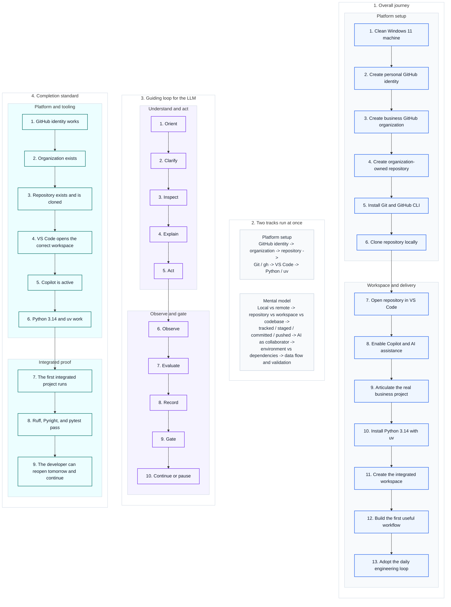

# 00 — Visual Meta Flow

This is the mental-model companion for the complete on-ramp.

```mermaid
flowchart TB
    classDef primary fill:#eff6ff,stroke:#2563eb,color:#111827,stroke-width:1.5px
    classDef model fill:#f5f3ff,stroke:#7c3aed,color:#111827,stroke-width:1.5px
    classDef outcome fill:#ecfeff,stroke:#0f766e,color:#111827,stroke-width:1.5px
    classDef note fill:#f8fafc,stroke:#cbd5e1,color:#1f2937,stroke-width:1.5px

    subgraph journey["1. Overall journey"]
        direction TB
        subgraph platform_setup["Platform setup"]
            direction LR
            j1["1. Clean Windows 11 machine"] --> j2["2. Create personal GitHub identity"] --> j3["3. Create business GitHub organization"] --> j4["4. Create organization-owned repository"] --> j5["5. Install Git and GitHub CLI"] --> j6["6. Clone repository locally"]
        end
        subgraph adoption["Workspace and delivery"]
            direction LR
            j7["7. Open repository in VS Code"] --> j8["8. Enable Copilot and AI assistance"] --> j9["9. Articulate the real business project"] --> j10["10. Install Python 3.14 with uv"] --> j11["11. Create the integrated workspace"] --> j12["12. Build the first useful workflow"] --> j13["13. Adopt the daily engineering loop"]
        end
        j6 --> j7
    end
    class j1,j2,j3,j4,j5,j6,j7,j8,j9,j10,j11,j12,j13 primary
    style journey fill:#ffffff,stroke:#cbd5e1
    style platform_setup fill:#f8fafc,stroke:#cbd5e1
    style adoption fill:#f8fafc,stroke:#cbd5e1

    subgraph tracks["2. Two tracks run at once"]
        direction LR
        platform["Platform setup<br/>GitHub identity -> organization -> repository -><br/>Git / gh -> VS Code -> Python / uv"]
        mental["Mental model<br/>Local vs remote -> repository vs workspace vs codebase -><br/>tracked / staged / committed / pushed -> AI as collaborator -><br/>environment vs dependencies -> data flow and validation"]
    end
    class platform,mental note
    style tracks fill:#ffffff,stroke:#cbd5e1

    subgraph llm_loop["3. Guiding loop for the LLM"]
        direction TB
        subgraph llm_first["Understand and act"]
            direction LR
            l1["1. Orient"] --> l2["2. Clarify"] --> l3["3. Inspect"] --> l4["4. Explain"] --> l5["5. Act"]
        end
        subgraph llm_second["Observe and gate"]
            direction LR
            l6["6. Observe"] --> l7["7. Evaluate"] --> l8["8. Record"] --> l9["9. Gate"] --> l10["10. Continue or pause"]
        end
        l5 --> l6
    end
    class l1,l2,l3,l4,l5,l6,l7,l8,l9,l10 model
    style llm_loop fill:#ffffff,stroke:#cbd5e1
    style llm_first fill:#f5f3ff,stroke:#cbd5e1
    style llm_second fill:#f5f3ff,stroke:#cbd5e1

    subgraph completion["4. Completion standard"]
        direction TB
        subgraph completion_first["Platform and tooling"]
            direction LR
            c1["1. GitHub identity works"] --> c2["2. Organization exists"] --> c3["3. Repository exists and is cloned"] --> c4["4. VS Code opens the correct workspace"] --> c5["5. Copilot is active"] --> c6["6. Python 3.14 and uv work"]
        end
        subgraph completion_second["Integrated proof"]
            direction LR
            c7["7. The first integrated project runs"] --> c8["8. Ruff, Pyright, and pytest pass"] --> c9["9. The developer can reopen tomorrow and continue"]
        end
        c6 --> c7
    end
    class c1,c2,c3,c4,c5,c6,c7,c8,c9 outcome
    style completion fill:#ffffff,stroke:#cbd5e1
    style completion_first fill:#ecfeff,stroke:#cbd5e1
    style completion_second fill:#ecfeff,stroke:#cbd5e1
```

The procedural guides remain the step-by-step operating layer.

[Back to the guide map](../README.md)
