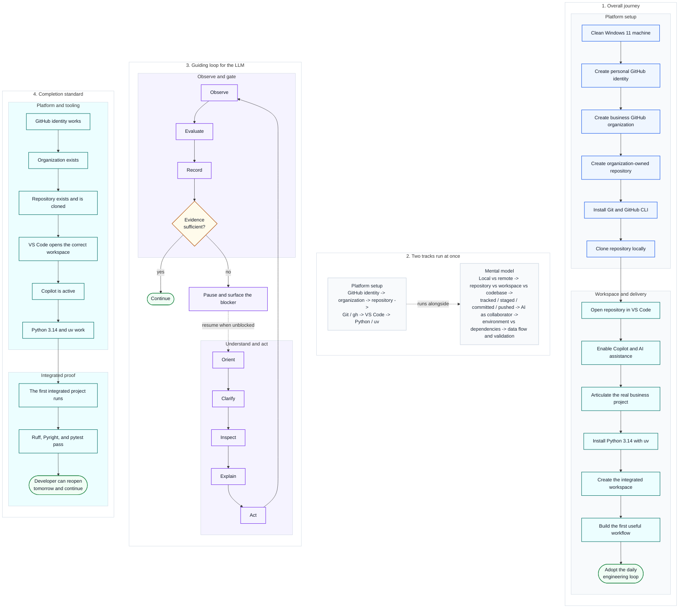

# 00 — Visual Meta Flow

This is the mental-model companion for the complete on-ramp.

Diagram legend: blue = platform-setup step, teal = workspace/delivery step, purple = mental-model concept, amber diamond = gate, green stadium = verified outcome. See [visuals/README.md](README.md#reading-these-diagrams) for the full shape vocabulary.

The procedural guides remain the step-by-step operating layer.

[Back to the guide map](../README.md)
