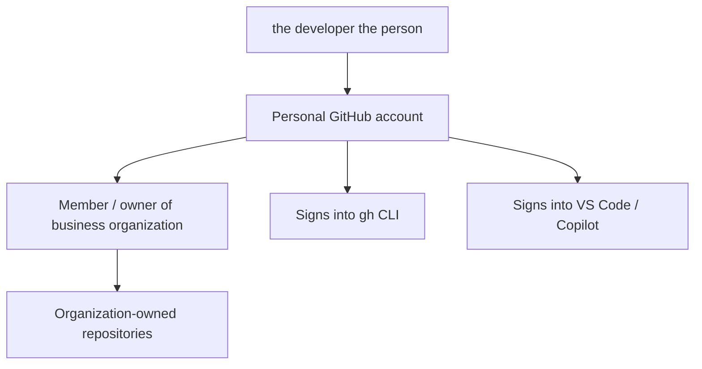
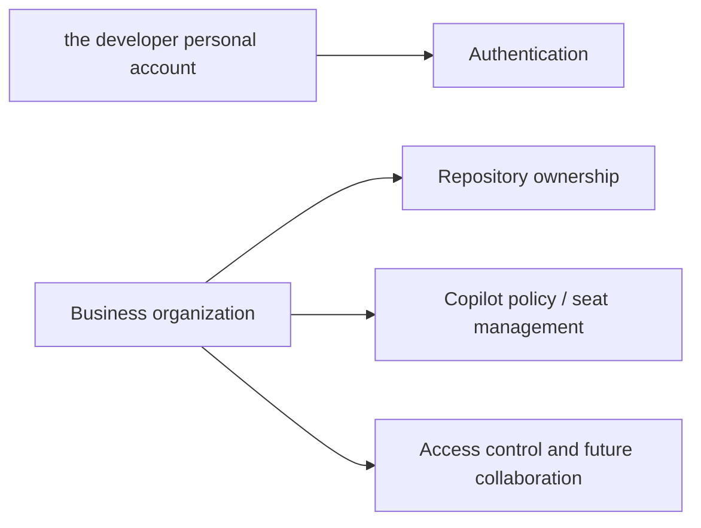
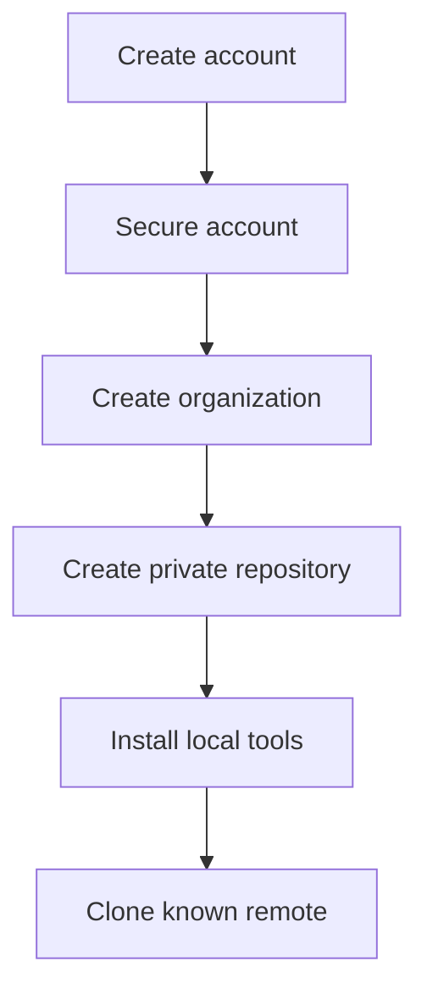
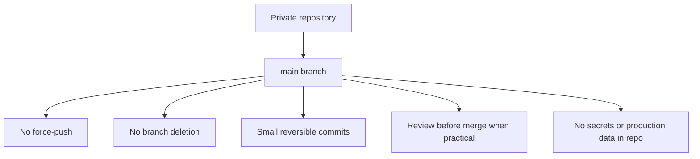
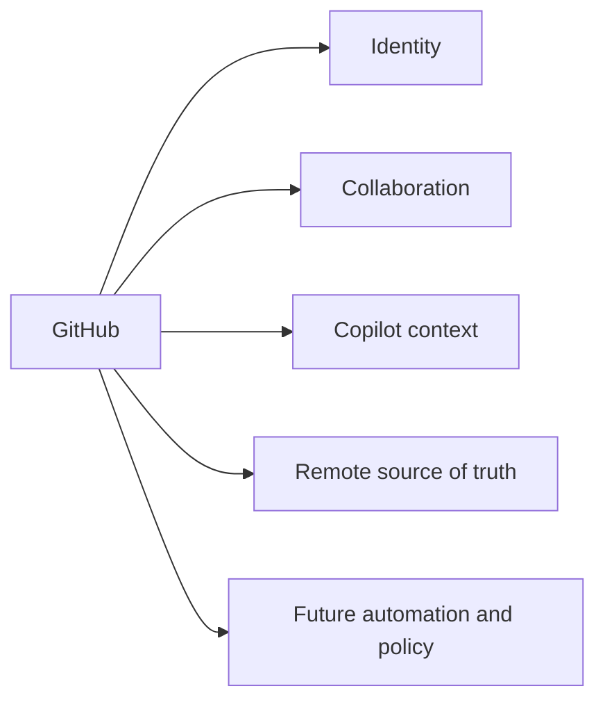

# 01 — Visual GitHub Foundation

This file explains why GitHub comes first.

## Identity model

## Ownership model

## Why this order helps

Because of that sequence:

- the remote location exists first;
- the local machine has something concrete to connect to;
- Git becomes easier to understand because the remote is real, not theoretical.

## Lightweight protection model

## Mental model: GitHub is not just backup

