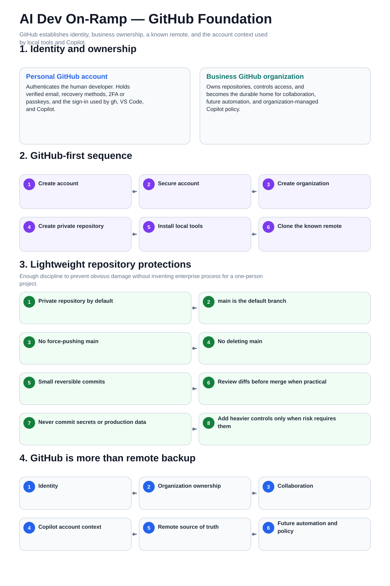

# 01 — Visual GitHub Foundation

This is the mental-model companion for GitHub identity, organization ownership, repositories, and lightweight protections.

The procedural guides remain the step-by-step operating layer.

[Back to the guide map](../README.md)
