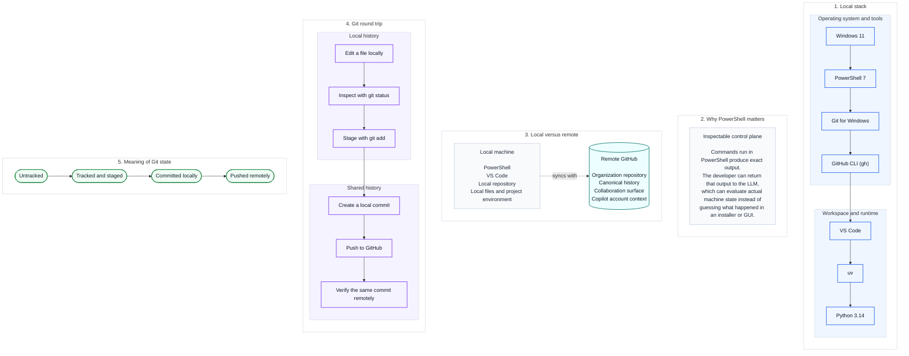

# 02 — Visual Local Toolchain

This is the mental-model companion for the Windows workstation, local tooling, and the Git round trip.

Diagram legend: blue = local-stack step, purple = round-trip step, teal/cylinder = durable remote store, amber stadium = tracked Git state, gray = explanatory note. See [visuals/README.md](README.md#reading-these-diagrams) for the full shape vocabulary.

The procedural guides remain the step-by-step operating layer.

[Back to the guide map](../README.md)
