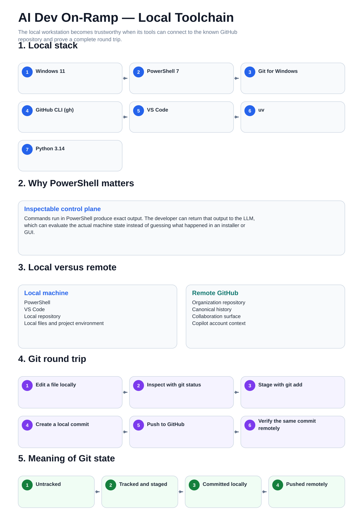

# 02 — Visual Local Toolchain

This is the mental-model companion for the Windows workstation, local tooling, and the Git round trip.

The procedural guides remain the step-by-step operating layer.

[Back to the guide map](../README.md)
