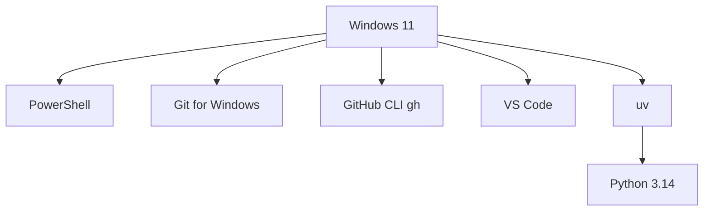
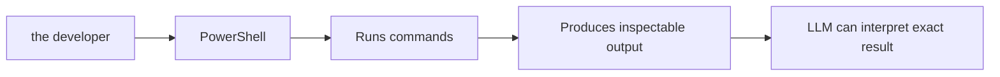
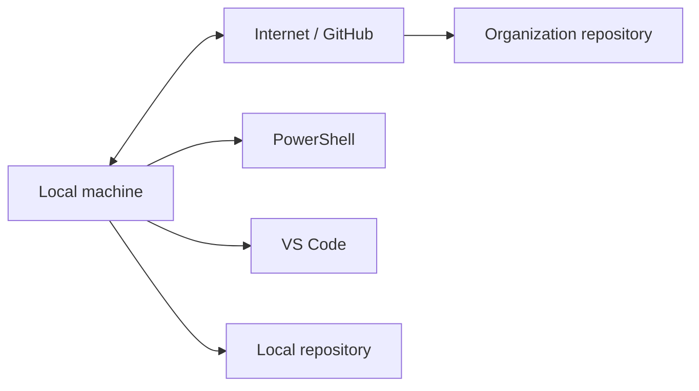
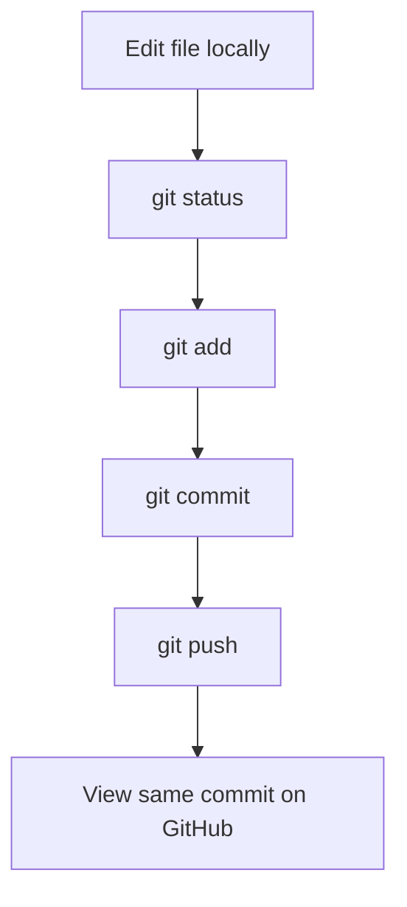
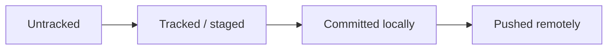
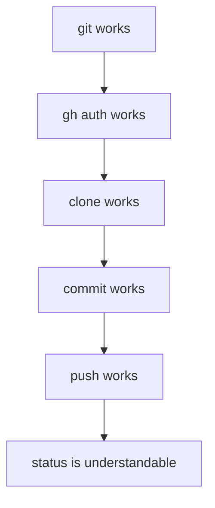

# 02 — Visual Local Toolchain

This file explains the local machine components.

## Local toolchain stack

## Why PowerShell matters

## Local vs remote

## Git round-trip

## Meaning of state

## The local machine becomes trustworthy when

