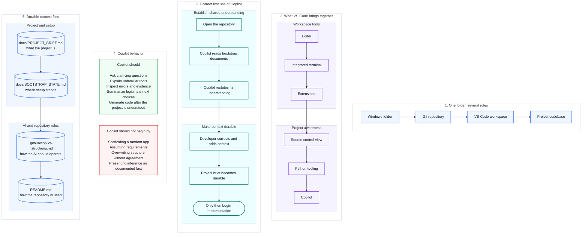

# 03 — Visual VS Code and Copilot

This is the mental-model companion for the integrated workspace and the correct first use of Copilot.

Diagram legend: blue = one-folder role, purple = workspace tool, teal = first-use step, green = do, red = avoid, cylinder = durable reference document. See [visuals/README.md](README.md#reading-these-diagrams) for the full shape vocabulary.

The procedural guides remain the step-by-step operating layer.

[Back to the guide map](../README.md)
