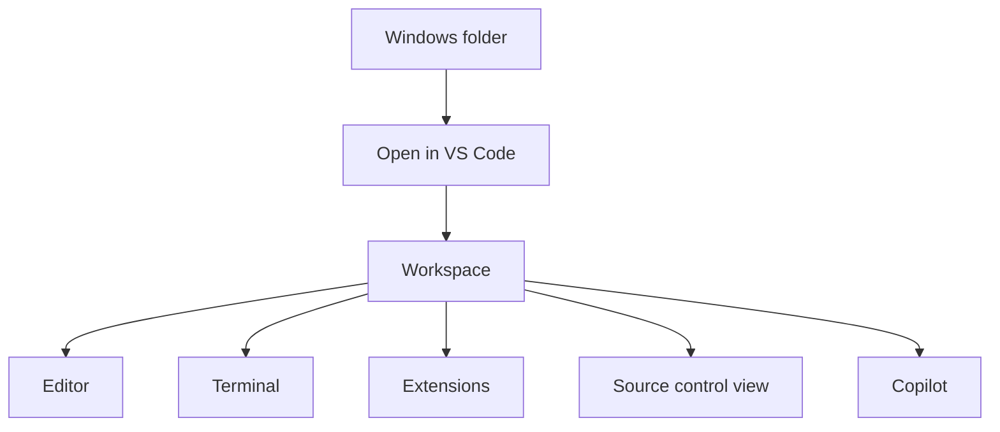
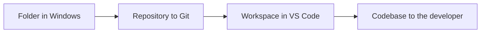
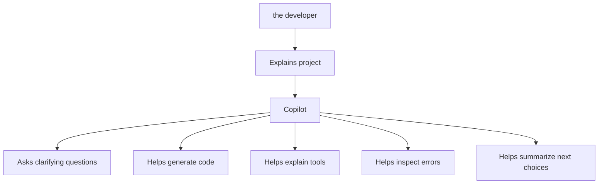
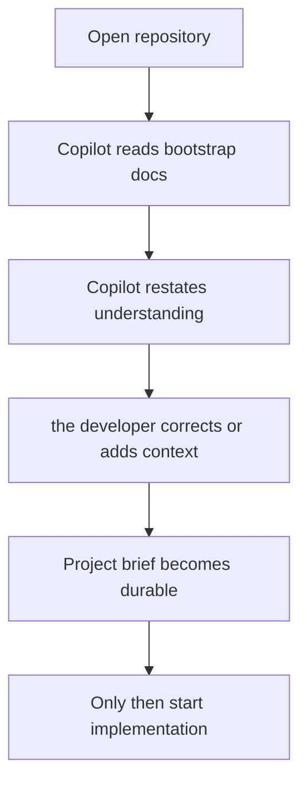
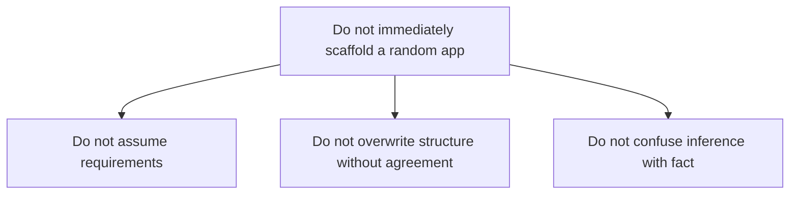
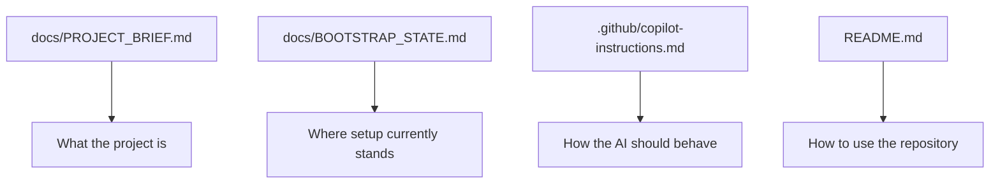

# 03 — Visual VS Code and Copilot

This file explains the coding workspace.

## What VS Code is

## Workspace mental model

One folder can serve several roles.

## Copilot positioning

## Correct first use of Copilot

## What Copilot should not do first

## Files that hold shared understanding

