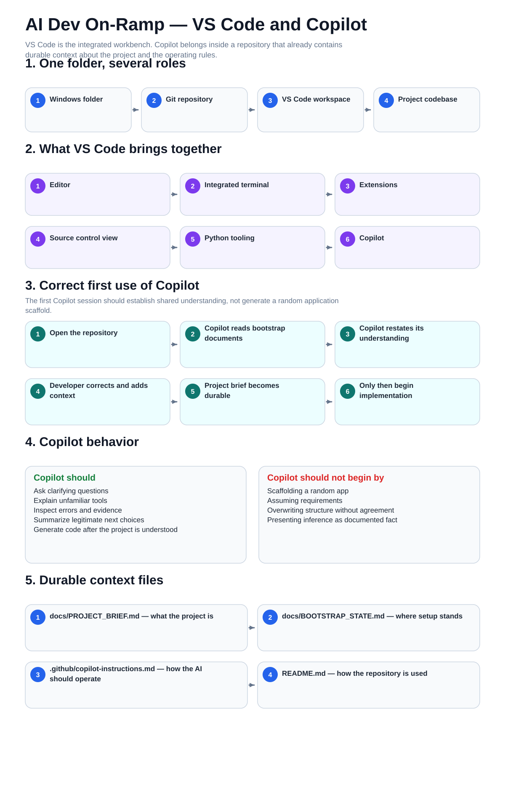

# 03 — Visual VS Code and Copilot

This is the mental-model companion for the integrated workspace and the correct first use of Copilot.

The procedural guides remain the step-by-step operating layer.

[Back to the guide map](../README.md)
