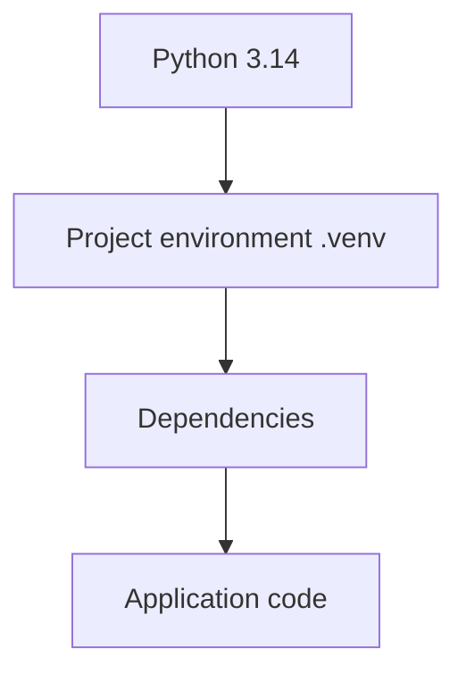
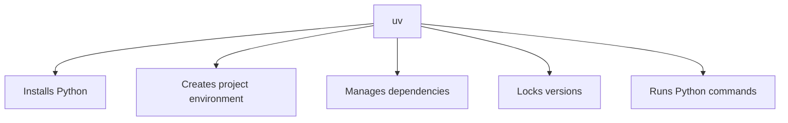
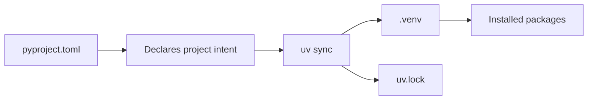
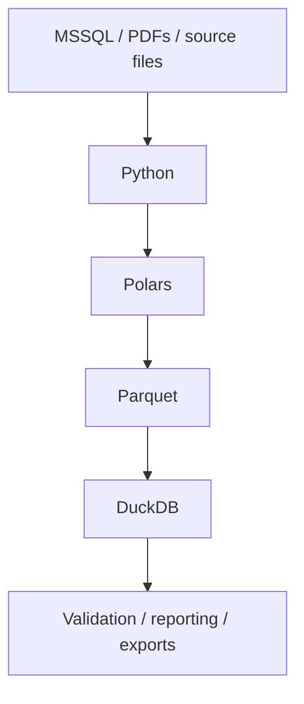
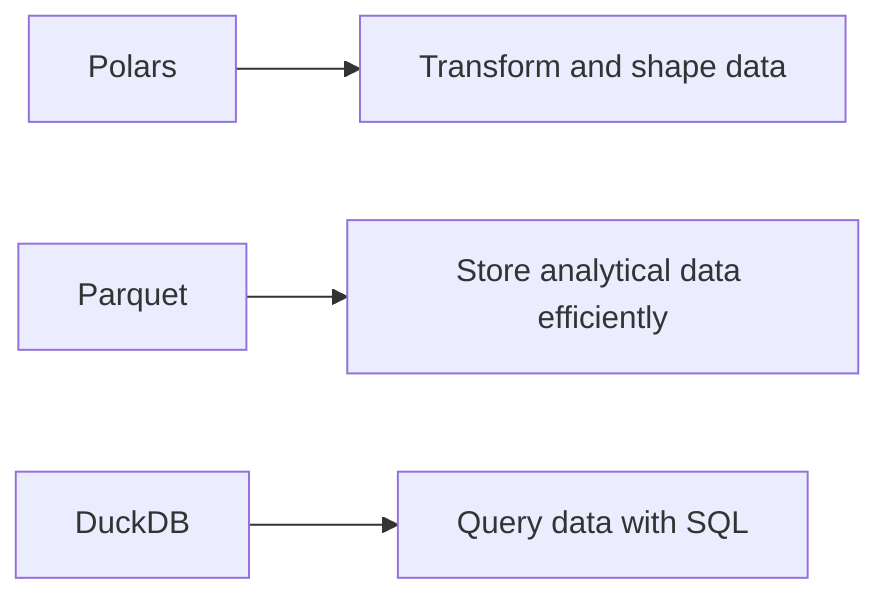
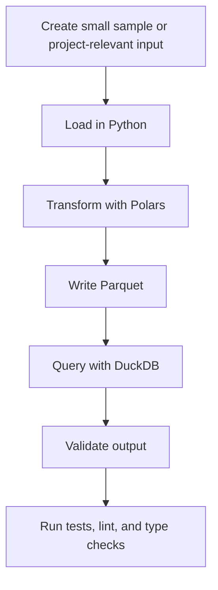
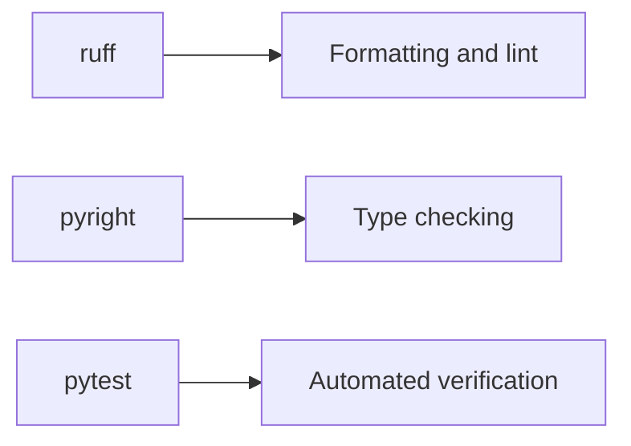

# 04 — Visual Python, uv, and the Integrated Workspace

This file explains the Python development environment.

## The Python stack

## uv’s role

## Dependency model

## Data stack mental model

## Roles of the core tools

## First integrated proof

## Quality gates

