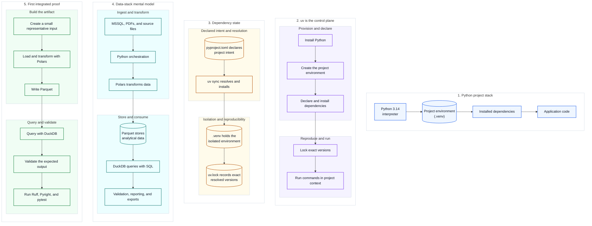

# 04 — Visual Python, uv, and the Integrated Workspace

This is the mental-model companion for Python, uv, project environments, dependencies, and the local data stack.

Diagram legend: blue = project-stack step, purple = uv control action, amber/cylinder = dependency artifact, teal = data-stack step, green = validation step. See [visuals/README.md](README.md#reading-these-diagrams) for the full shape vocabulary.

The procedural guides remain the step-by-step operating layer.

[Back to the guide map](../README.md)
