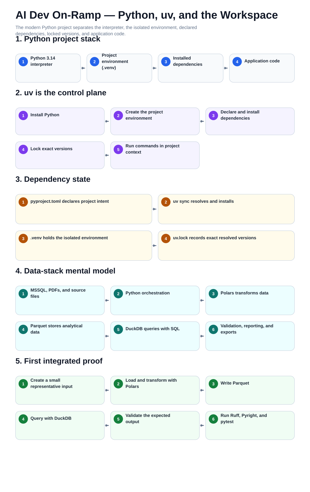

# 04 — Visual Python, uv, and the Integrated Workspace

This is the mental-model companion for Python, uv, project environments, dependencies, and the local data stack.

The procedural guides remain the step-by-step operating layer.

[Back to the guide map](../README.md)
