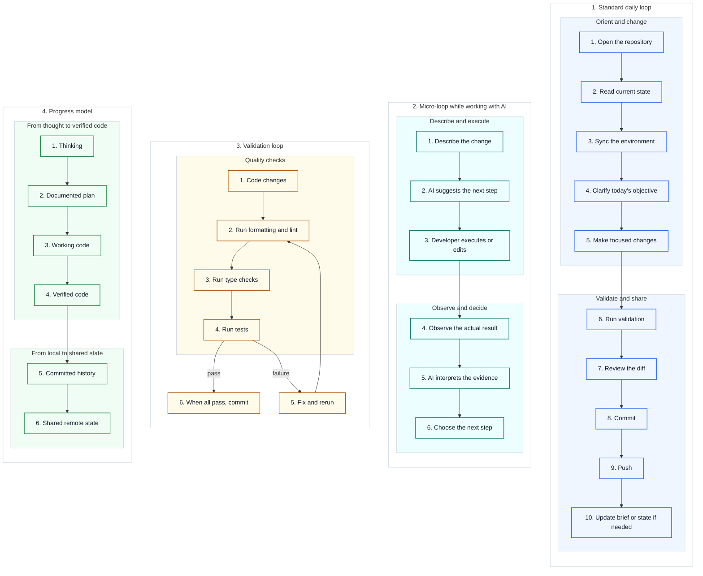

# 05 — Visual Daily Engineering Loop

This is the mental-model companion for the normal inspect, change, validate, commit, and push cycle.

The procedural guides remain the step-by-step operating layer.

[Back to the guide map](../README.md)
