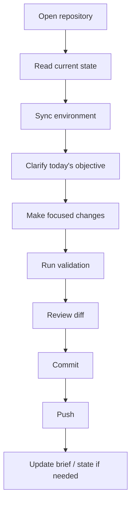
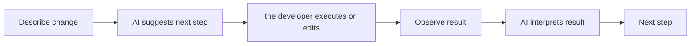
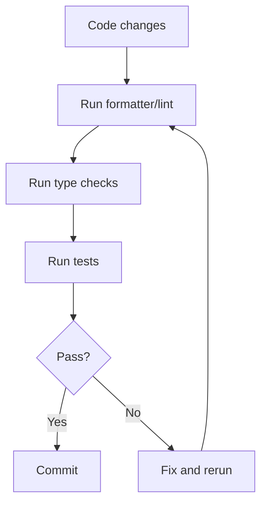
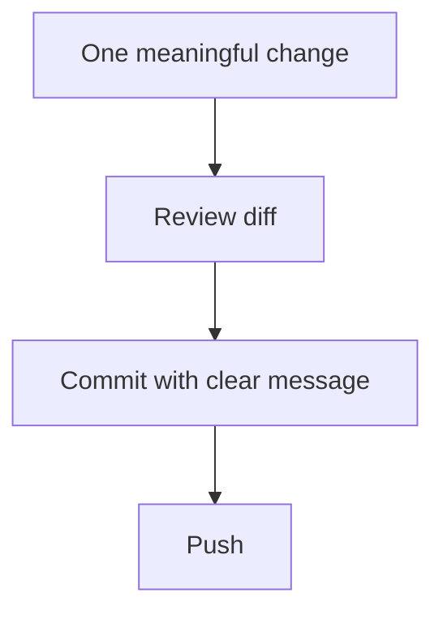
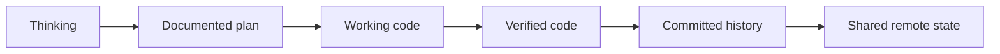

# 05 — Visual Daily Engineering Loop

This file shows the routine after the platform exists.

## Standard daily loop

## Micro-loop while working with AI

## Validation loop

## Commit discipline

## Mental model of progress

