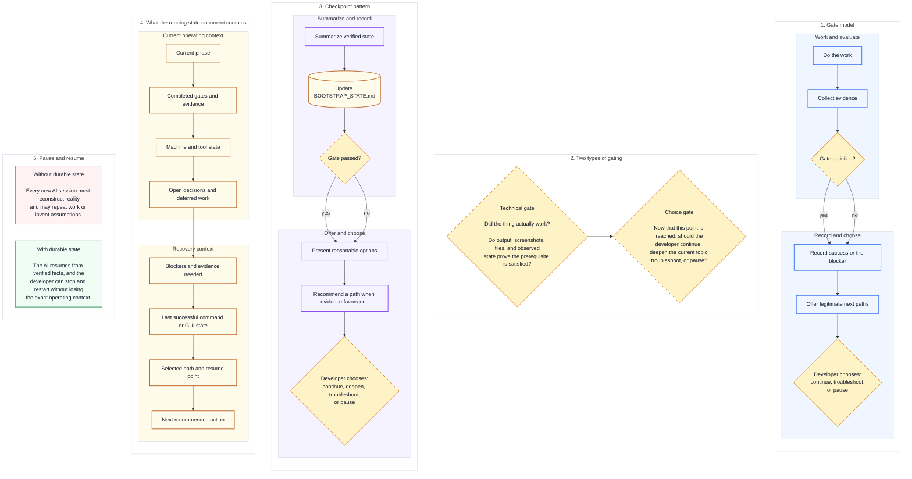

# 06 — Visual Gating and State

This is the mental-model companion for technical gates, choice gates, and the durable running-state document.

Diagram legend: blue = work step, purple = checkpoint step, amber diamond = gate/decision, amber/cylinder = durable state artifact, red = risk without state, green = benefit with state. See [visuals/README.md](README.md#reading-these-diagrams) for the full shape vocabulary.

The procedural guides remain the step-by-step operating layer.

[Back to the guide map](../README.md)
