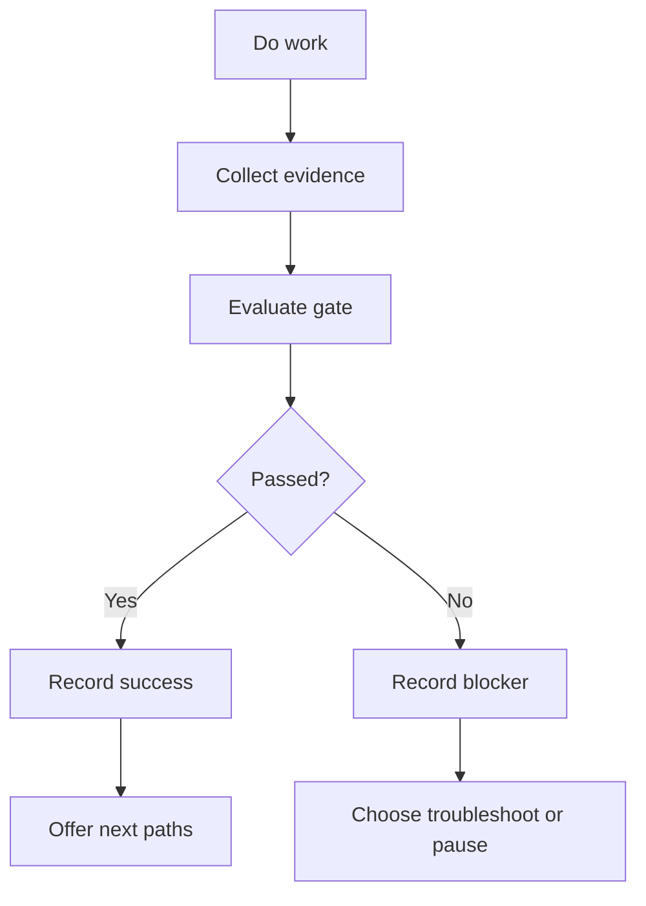
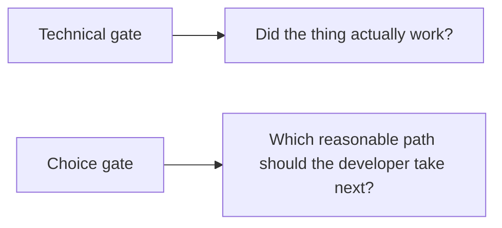
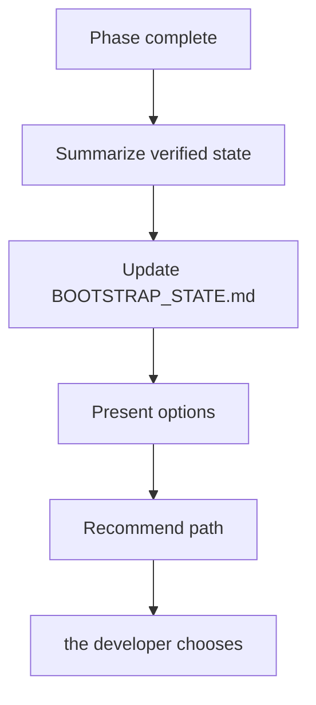
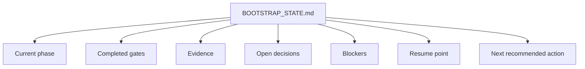
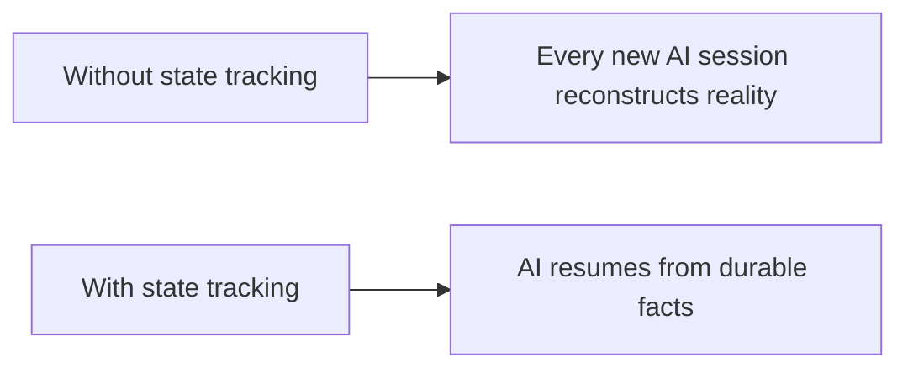
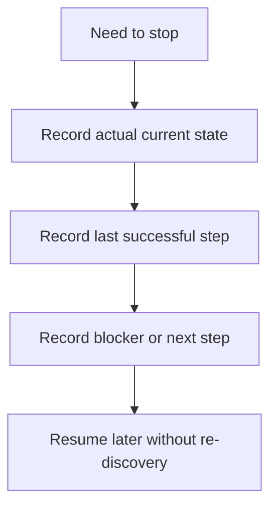

# 06 — Visual Gating and State

This file explains why gates and a running state document exist.

## Gate model

## Two types of gating

## Example checkpoint pattern

## Running state document

## Why this helps

## Pause / resume model

